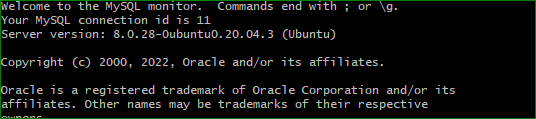
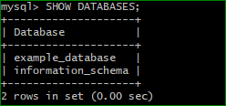
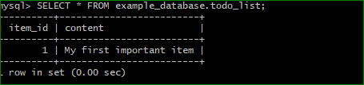

	# PROJECT 2 DOCUMENTATION

`sudo apt update`

`sudo apt install nginx`

`sudo systemctl status nginx`

`curl http://localhost:80`

[public ip](https://www.ec2-3-85-107-21.compute-1.amazonaws.com)

`sudo apt install mysql-server`

`sudo mysql_secure_installation`

`sudo mysql`

`mysql> exit`

`sudo apt install php-fpm php-mysql`

`sudo mkdir /var/www/projectLEMP`

`sudo chown -R $USER:$USER /var/www/projectLEMP`

`sudo nano /etc/nginx/sites-available/projectLEMP`

`sudo nginx -t`

`sudo unlink /etc/nginx/sites-enabled/default`

`sudo systemctl reload nginx`

`sudo nano /var/www/projectLEMP/info.php`

http://ec2-3-85-107-21.compute-1.amazonaws.com/info.php

`sudo rm /var/www/your_domain/info.php`

`sudo mysql`

`mysql> CREATE DATABASE `example_database`;`

`mysql>  CREATE USER 'example_user'@'%' IDENTIFIED WITH mysql_native_password BY 'password';`

`mysql> GRANT ALL ON example_database.* TO 'example_user'@'%';`

`mysql> exit`

`mysql -u example_user -p`

`mysql> SHOW DATABASES;`

`mysql> INSERT INTO example_database.todo_list (content) VALUES ("My first important item");`

`mysql>  SELECT * FROM example_database.todo_list;`

`mysql> exit`

`nano /var/www/projectLEMP/todo_list.php`

http://ec2-3-85-107-21.compute-1.amazonaws.com/todo_list.php

